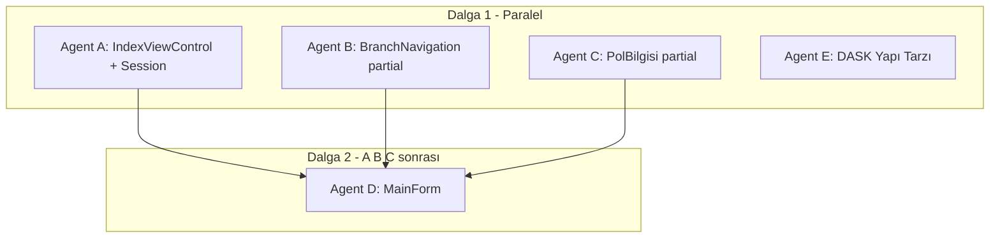

# Faz 1 Paralel Agent Planı

Bu doküman, Faz 1 görevlerinin birden fazla Cursor agent tarafından paralel ve çakışmasız çalıştırılması için hazırlanmıştır.

## Paralel Çalışma Kuralları

- Her agent yalnızca kendi atanan dosyalara dokunur
- Aynı dosyada birden fazla agent çalışmaz (merge conflict önleme)
- Bağımlılık grafiğine uyulur

## Mevcut Durum (Zaten Var)

| Bileşen | Dosya |
|---------|-------|
| SorguSession, SorguDurum | Models/SorguSession.cs |
| BranchCellClickEventArgs | Models/BranchCellClickEventArgs.cs |
| Sigorta şirket listesi | Data/SigortaSirketleri.cs |
| DASK İl/İlçe cascade | Forms/DaskDetaylariForm.cs |

---

## Agent Dağılımı

---

## Hızlı Referans Tablosu

| Agent | Dosyalar | Bağımlılık |
|-------|----------|------------|
| **A** | IndexViewControl.cs, IndexViewControl.Session.cs (yeni) | - |
| **B** | IndexViewControl.BranchNavigation.cs (yeni) | - |
| **C** | IndexViewControl.PolBilgisi.cs (yeni) | A (Tag ataması) |
| **D** | MainForm.cs | A, B, C |
| **E** | DaskDetaylariForm.cs, YapiTarziOptions.cs (yeni) | - |

**Dalga 1 (paralel):** A, B, C, E  
**Dalga 2:** D (A, B, C tamamlandıktan sonra)

---

## Agent Talimatları Özeti

### Agent A
- IndexViewControl.Session.cs: partial, GetSorguSession, SetSorguSession, ClearForm, SetSorguDurum
- IndexViewControl.cs: AddFormRow refactor, BuildRightPanel güncellemesi, PolicyType'dan BranchFormRequested kaldır, BranchCellClickRequested event, Load'a SetupBranchNavigation + LoadPolBilgisiData, Tag atamaları

### Agent B
- IndexViewControl.BranchNavigation.cs: SetupBranchNavigation, _companyGrid.CellClick handler
- IndexViewControl.cs'ye dokunmaz

### Agent C
- IndexViewControl.PolBilgisi.cs: LoadPolBilgisiData, Sigorta combo doldurma, Kalan Gün hesaplama
- Tag ile Trafik tab kontrollerini bulur (Agent A Tag atar)

### Agent D
- MainForm.cs: SorguBaslatRequested, DuraklatRequested, YeniSorguKaydetRequested gerçek handler'ları
- BranchCellClickRequested handler (TRAFİK, KASKO, TSS, DASK, KONUT, İMM formları)

### Agent E
- YapiTarziOptions.cs: DASK yapı tarzı listesi
- DaskDetaylariForm: _cmbYapiTarzi doldurma

---

## VegaAsis.Windows.csproj Güncellemeleri

Her agent yeni dosya eklediyse csproj'a Compile Include eklemeli:

- Agent A: `UserControls\IndexViewControl.Session.cs`
- Agent B: `UserControls\IndexViewControl.BranchNavigation.cs`
- Agent C: `UserControls\IndexViewControl.PolBilgisi.cs`
- Agent E: `Data\YapiTarziOptions.cs` (yoksa)

Detaylı teknik açıklamalar için `Faz1-Detayli-Uygulama-Plani.md` ve Cursor plan dosyasına bakınız.
